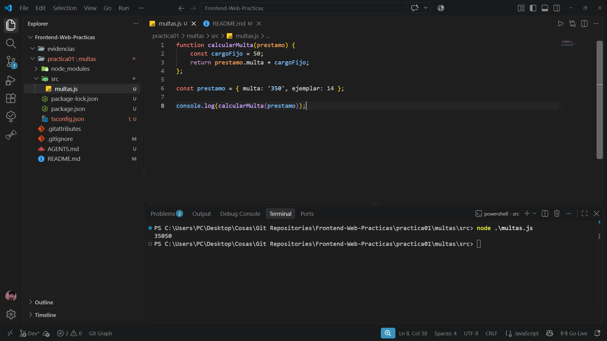
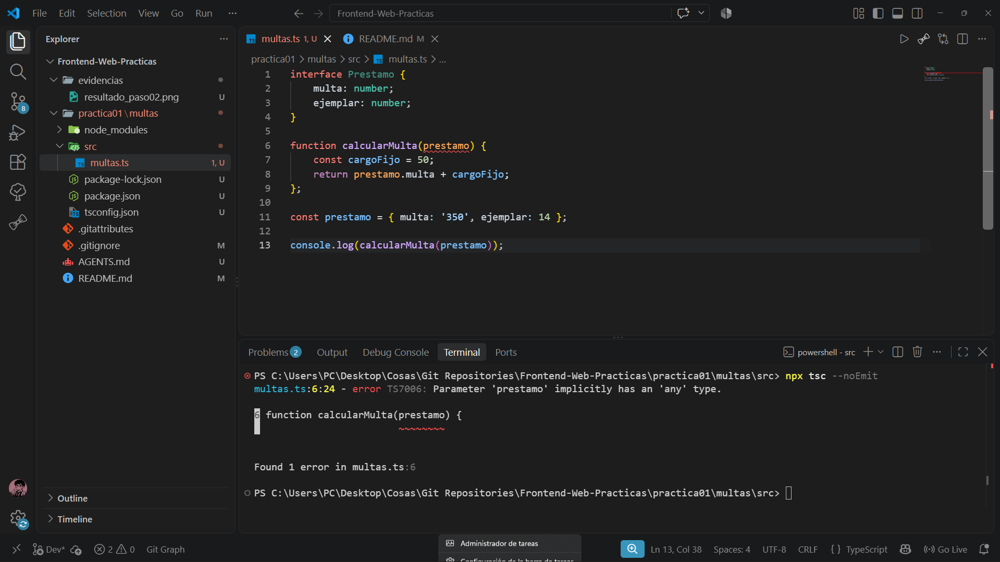
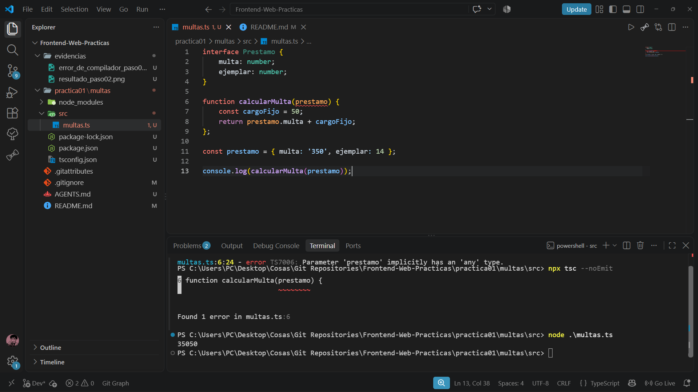
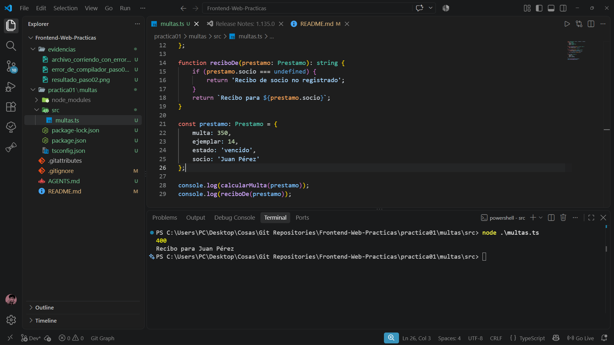

# Frontend-Web-Practicas

## Paso 2. Escribir el error de JavaScript.

### - ¿Que creo que se va a imprimir?
Se imprimira "35050" porque la funcion esta solamente cambiando el valor de la variable ***cargoFijo***, y en cuanto a la variable ***multa*** esta tiene el valor de ***'350'*** como string, por lo que solo concatenara los valores de la string, junto con el valor numerico 50.

### 1. ¿Hubo algun error, alguna advertencia o algo en la consola que avisara?
Se mostro lo que creia que se iba a imprimir, pero ni la consola ni el editor de texto mostraron ningun error en el archivo de JS.

## Paso 3. Anotar el tipo.

### 1. Si el archivo tiene un error de tipos, ¿por que node lo ejecuta? ¿Cual comando revisa y cual ejecuta?
Node lo ejecuta porque el comando que revisa es el de typescript, ya que **npx tsc** se encarga de compilar el typescript, pero se ejecuta como tal el javascript, ya que typescript solo se encarga de agregar las anotaciones, pero node corre el arhivo como si fuera javascript.

## Paso 4. Declarar variables.

### 1. De las dos lineas que usan const, ¿por que solo una falla?
Esto sucede porque **const** genera una variable que es "cosntante" de manera que cuando se inicialice, solo va a tomar ese valor, y no podra cambiar despues.

### 2. Al asignarle un texto a la variable con let, nadie escribio que fuera un numero. ¿De donde salio ese tipo?
El tipo se genera al momento de inicializar la variable, como se creo con el valor inicial de ***0*** el compilador de javascript establece que esa variable debera contener un valor numerico, por lo que al cambiar su valor a un string genera un error.

## Paso 5. Modelar el prestamo.

### Programa sin errores e imprimiendo el recibo y la multa de manera correcta.

## Paso 6. Provocar tres errores distintos.

### Error 1.
console.log(calcularMulta("hola"));

multas.ts:31:27 - error TS2345: Argument of type 'string' is not assignable to parameter of type 'Prestamo'.

- Esperaba: Un parametro de tipo Prestamo.
- Recibio: Un string.
- Linea: 31

### Error 2.
console.log(calcularMulta({ multa: 350, ejemplar: 14 }));

multas.ts:32:27 - error TS2345: Argument of type '{ multa: number; ejemplar: number; }' is not assignable to parameter of type 'Prestamo'.
  Property 'estado' is missing in type '{ multa: number; ejemplar: number; }' but required in type 'Prestamo'.

- Esperaba: Se esperaba un prestamo completo (que tuviera el estado).
- Recibio: Un objeto sin estado.
- Linea: 32

### Error 3.
console.log(calcularMulta({ multa: '350', ejemplar: 14, estado: 'activo' }));

multas.ts:33:29 - error TS2322: Type 'string' is not assignable to type 'number'.

- Esperaba: Que la variable ***multa*** fuera un number.
- Recibio: Una multa como string
- Linea: 33